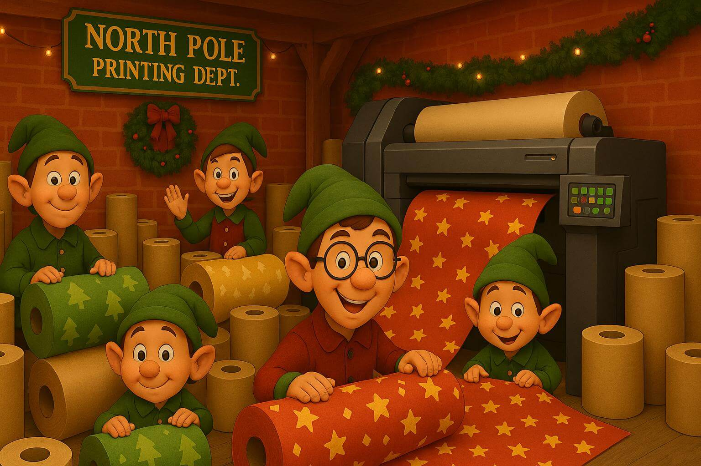

# AoC25 - Day04
_Note: this README was generated from the implementation in `Day04/Solver.cs`._

**Image Prompt:** _Please generate an image that depicts the following description: "A north pole secret base printing department. The people there are clearly getting ready for Christmas; they have lots of large rolls of paper everywhere, and there's even a massive printer in the corner (to handle the really big print jobs)." The style of the picture must be like Pixar movies._

## Problem summary
The input describes a rectangular character grid (one string per row). Cells contain characters; the solver treats the character `'@'` as occupied and `'.'` as empty. Starting from an initial grid, the task is to count cells that are "removable" according to a neighbourhood rule, and (for part 2) to repeatedly remove such cells until no more removals are possible, returning the total number removed.

Removability rule (used in both parts):
- A cell at coordinate (x,y) is considered removable if:
  - its value is `'@'`, and
  - among its 8 neighboring coordinates (Moore neighborhood), strictly fewer than 4 neighbors are `'@'` (only neighbours that exist in the grid are considered).

Outputs:
- Part 1: the number of removable `'@'` cells in the initial grid.
- Part 2: the total number of `'@'` cells removed when repeatedly removing all currently removable cells (setting them to `'.'`) until no more removals occur.

## Input format
- A list of strings, one per grid row. All rows may be assumed to have the same length.
- Example row characters: `@`, `.`, or any other characters (only `'@'` is considered for removal).

## How the solution works

Common setup:
- The code maps each character to a `Dictionary<Coord2D, char>` keyed by coordinates (column = x, row = y).
- `Coord2D.GetNeighbors8()` is used to obtain the 8 neighbor coordinates for a given cell; only neighbours present in the dictionary are considered.

ParseGrid:
- Iterates input lines and columns, storing `grid[new Coord2D(col, row)] = ch` for every cell.

GetRemovable:
- Enumerates all keys where `grid[key] == '@'`.
- For each such key, counts how many of its existing neighbors hold `'@'`.
- If that count is less than 4, the key is considered removable.
- Returns the list of removable coordinates.

Part 1:
- Parse the grid and return the count of removable `'@'` cells computed by `GetRemovable()`.

Part 2:
- Repeatedly:
  - Compute `toRemove = GetRemovable()`.
  - If `toRemove` is empty, stop.
  - Otherwise, set `grid[cell] = '.'` for each `cell` in `toRemove` and add `toRemove.Count` to the running total.
- Return the total number of removed cells as a string.

## Examples
Given input (rows):
- Example A
  - "....."
  - ".@@.."
  - ".@@.."
  - "....."

This 2x2 block of `'@'` produces:
- Part 1: `4` removable cells (each `'@'` in the 2x2 has fewer than 4 neighbouring `'@'`).
- Part 2: also `4` (all are removed in the first iteration).

(These examples are illustrative; behavior depends on the precise neighbourhood counts in a given input.)

## Implementation notes
- The solver uses a coordinate dictionary `Dictionary<Coord2D, char>` so the grid is indexed by (x,y).
- `ParseGrid` fills the global `grid` map by column and row indices (column = x, row = y).
- `GetRemovable` uses only neighbours that are present in the dictionary (no implicit out-of-range neighbours).
- Part 1 is a single scan: O(n) where n = number of cells.
- Part 2 may iterate multiple rounds until stabilization; worst-case complexity is O(r * n) where r is the number of rounds required.
- The code mutates the global `grid` when performing part 2 removals (cells are set to `'.'`).

Notes / caveats:
- `ParseGrid` writes into a static `grid` field and does not clear it at the start; if the solver is invoked multiple times in the same process without restarting or explicitly clearing `grid`, previous data may persist. This is acceptable for a single-run CLI execution but worth noting for reuse in a long-lived process.
- The implementation relies on `Coord2D` and its `GetNeighbors8()` helper; ensure that type behaves as expected for coordinate equality and neighbour generation.

## Behavioural guarantee
- The implementation follows the described removal rule exactly: removable `'@'` cells are those with strictly fewer than 4 `'@'` neighbours among the 8 surrounding cells, considering only existing grid positions. Part 2 removes in synchronous rounds (all currently removable cells are removed simultaneously each round) until no more removals are possible.