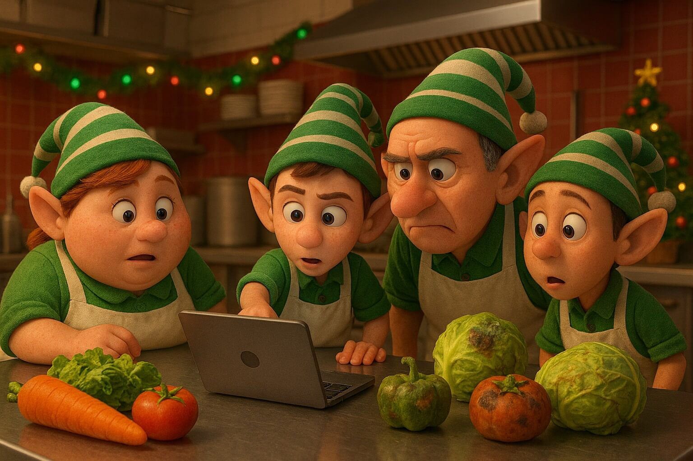

# AoC25 - Day05
_Note: this README was generated from the implementation in `Day05/Solver.cs`._

**Image prompt:** _Generate a picture of a crew of elves in a kitchen of a cafeteria, in a christmas environment, looking to a computer to decide which ingredients are fresh and which are spoiled. The image must have the style of a pixar movie._

## Problem summary
Input consists of two sections separated by a blank line. The first section lists inclusive ID ranges in the form `low-high` (one per line). The second section lists individual numeric IDs (one per line).

- Part 1: Count how many of the listed IDs fall inside at least one of the ranges.
- Part 2: Merge all intersecting or containing ranges and return the total number of distinct IDs covered by the merged ranges (i.e., sum of sizes of merged ranges).

## Input format
- A list of lines. Lines before the first empty line are range definitions of the form `123-456`.
- After a single blank line, the remaining lines are integer IDs to be tested, one per line.

## How the solution works

Common data structures:
- `IdRange` record represents an inclusive range with `Low` and `High` (long).
  - `InRange(long num)` returns true when `num` is between `Low` and `High` inclusive.
  - `Contains(IdRange other)` tests if one range fully contains the other.
  - `Overlaps(IdRange other)` tests if ranges overlap by endpoints/intervals.
  - `Intersects(IdRange other)` returns true if ranges contain or overlap each other.
  - `Merge(IdRange other)` returns a new range spanning the min `Low` and max `High`.
  - `Count()` returns the inclusive count `High - Low + 1`.

Parsing (`ParseInput`):
- The input is split at the first empty line.
- Lines before the separator are parsed as ranges and stored in the `ranges` list.
- Lines after the separator are parsed into `nums` list of long values.

Part 1 (`SolvePart1`):
- For each number in `nums`, check if any range in `ranges` returns true for `InRange(num)`.
- Return the count of numbers that are inside at least one range.

Part 2 (`SolvePart2`):
- First call `MergeAllYouCan()` to merge all ranges that intersect or contain each other.
- After merging, compute the sum of `Count()` for each merged range and return that total as the number of distinct IDs covered.

Merge strategy (`MergeAllYouCan`):
- Start with a copy of `ranges` called `mergedRanges`.
- Repeatedly scan `mergedRanges` for any pair of ranges that `Intersects`.
- When a pair is found, remove both and add their `Merge()` result to a new list, then restart scanning from the beginning.
- Repeat until a full pass finds no intersecting pairs.
- Replace the original `ranges` with the final merged list.

## Examples
Using the example input above:
- Ranges: `10-20`, `30-35`, `40-45`
- Numbers: `12`, `29`, `33`, `42`

Part 1:
- `12` is inside `10-20` → counted
- `29` is not inside any range → not counted
- `33` is inside `30-35` → counted
- `42` is inside `40-45` → counted
- Result: `3`

Part 2 (if ranges were `10-20`, `15-25`, `30-35`):
- `10-20` and `15-25` intersect and would be merged to `10-25`.
- Sum of counts after merging: `10-25` → 16 IDs, `30-35` → 6 IDs → total 22.

## Implementation notes and caveats
- The solver uses static lists `ranges` and `nums` which are appended to in `ParseInput`. They are not cleared at the start of `ParseInput`, so calling `Solve` multiple times in the same process without resetting these lists will accumulate data across calls.
- `MergeAllYouCan()` performs repeated pairwise merging until no intersections remain. The algorithm is simple and correct for small to moderate input sizes but is O(n^2) or worse in pathological cases; a more efficient approach (sort+merge) would be recommended for very large inputs.
- `IdRange.Count()` returns `High - Low + 1` and assumes `Low <= High` for every parsed range.

## Behavioural guarantee
- Part 1 counts numbers that are within any original range.
- Part 2 returns the total number of distinct IDs covered after fully merging all intersecting/containing ranges.

## Suggested improvements (optional)
- Clear `ranges` and `nums` at the start of `ParseInput` to avoid accidental accumulation across multiple runs.
- Implement a sort-and-sweep merge strategy: sort ranges by `Low` and perform a single pass merging overlapping ranges in O(n log n) time for sorting plus O(n) merging.