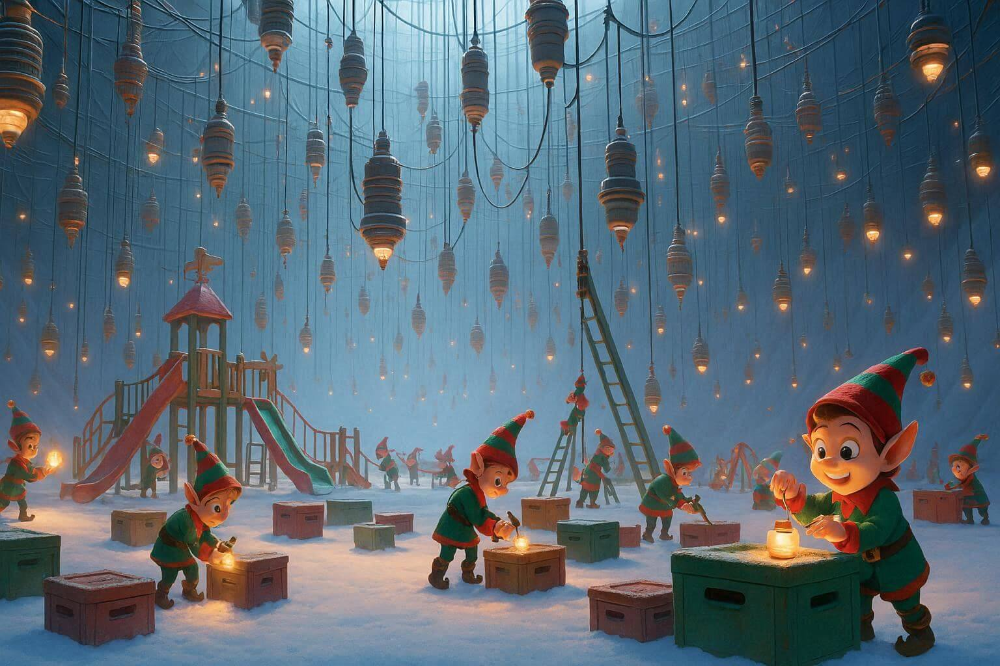

# AoC25 - Day08
_Note: this README was generated automatically by Copilot from the implementation in `Day08/Solver.cs`._

**Image prompt:** _Generate a vast underground space which contains a giant playground! Across the playground, a group of Elves are working on setting up an ambitious Christmas decoration project. Through careful rigging, they have suspended a large number of small electrical junction boxes. The image must have a style of Zootopia, the movie by Pixar._

## Problem summary
The input is a list of 3D positions (one per line, format `x,y,z`). Each position represents a box in space. The solver computes all pairwise distances between boxes and uses the closest pairs to merge boxes into "circuits" by repeated union operations.

Two results are produced:
- Part 1: consider the 1000 closest pairs (by distance). For each pair, if the two boxes belong to different circuits, merge those circuits. After processing the 1000 pairs, take the sizes of the three largest circuits and return their product.
- Part 2: repeatedly pick the closest pair that connects two different circuits and merge them until no such pair remains. Track the x coordinates of the two boxes in the last merged pair and return their product.

## Input format
- Each line contains three integers separated by commas: `x,y,z`.
- Example:
  - 1,2,3
  - 4,5,6
  - -2,0,7

## How the solution works

Common setup:
- Parse each line into a `Coord3DL` and add it to `BoxPositions`.
- Build all unique pairs (i < j) and compute their Euclidean distance; store pairs as `PairInfo { Item1, Item2, Distance }`.
- Sort the `Pairs` list by `Distance` ascending.
- `BoxInCircuit` maps each box index to a circuit id; initially each box is its own circuit (i -> i).

Part 1:
- Iterate over the first 1000 pairs in sorted order.
- For each pair, if the two boxes belong to different circuits, relabel every box in the second circuit to the first circuit id (merge).
- After processing 1000 pairs, group boxes by circuit id, take the three largest group sizes and return their product as a string.

Part 2:
- Repeatedly find the next pair (in distance order) that connects two different circuits and merge them (same relabeling).
- Keep the x coordinates of the last merged pair and return the product x1 * x2 as a string when no more cross-circuit pairs remain.

## Implementation notes
- The solver constructs all O(N^2) pairs; this is simple but may be heavy in time and memory for large N.
- Circuit merging uses full relabeling by iterating keys in `BoxInCircuit` rather than an optimized disjoint-set (Union-Find).
- Distances are stored as `double` in `PairInfo.Distance`.
- Part 1 assumes at least 1000 pairs exist; for very small inputs this may cause issues.

## Possible improvements
- Replace relabeling with a Union-Find (disjoint set) structure to achieve near-constant amortized merges and faster queries.
- Avoid generating all pairs for large N by using spatial partitioning (k-d tree, nearest-neighbor structures) or incremental nearest-neighbor search.
- Add input validation: confirm each line has exactly three integers and handle cases with fewer than 1000 pairs.
- Use larger numeric types (e.g., BigInteger) if products might exceed 64-bit range.